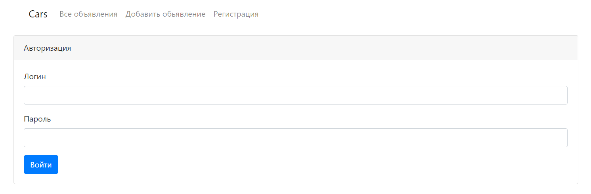
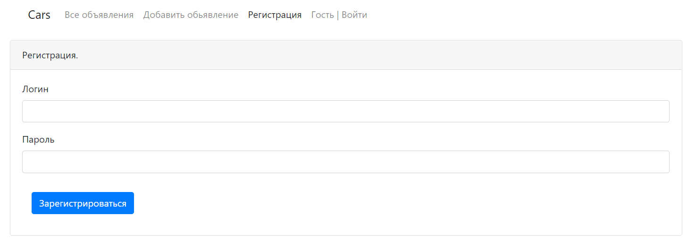
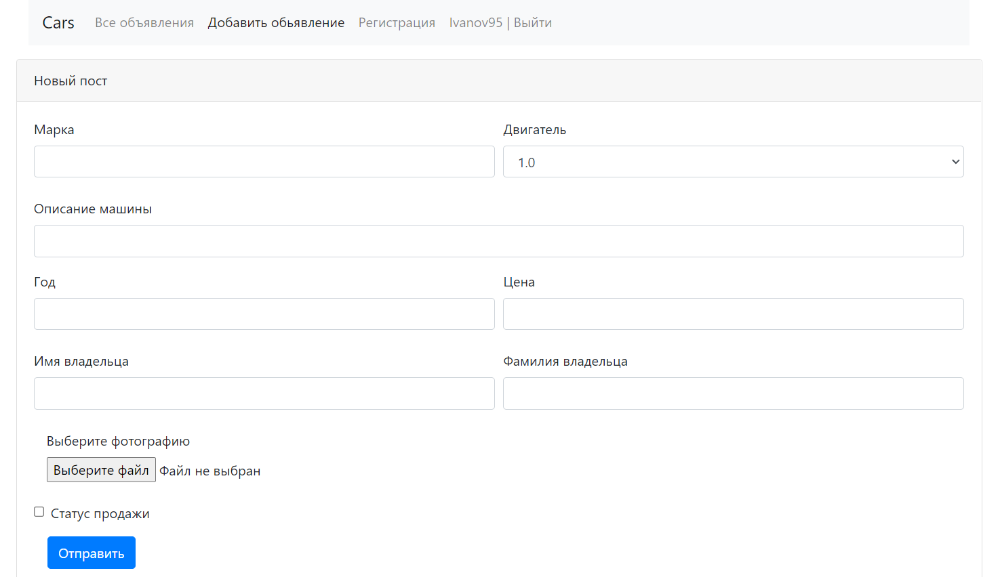
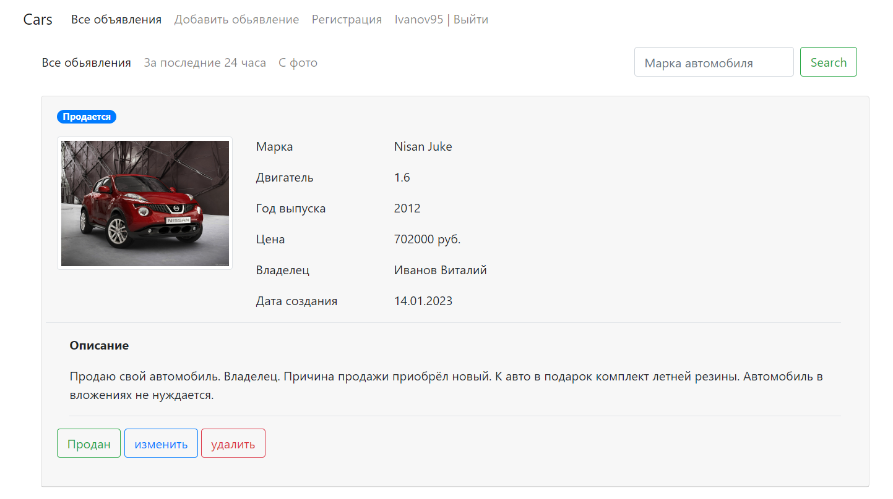
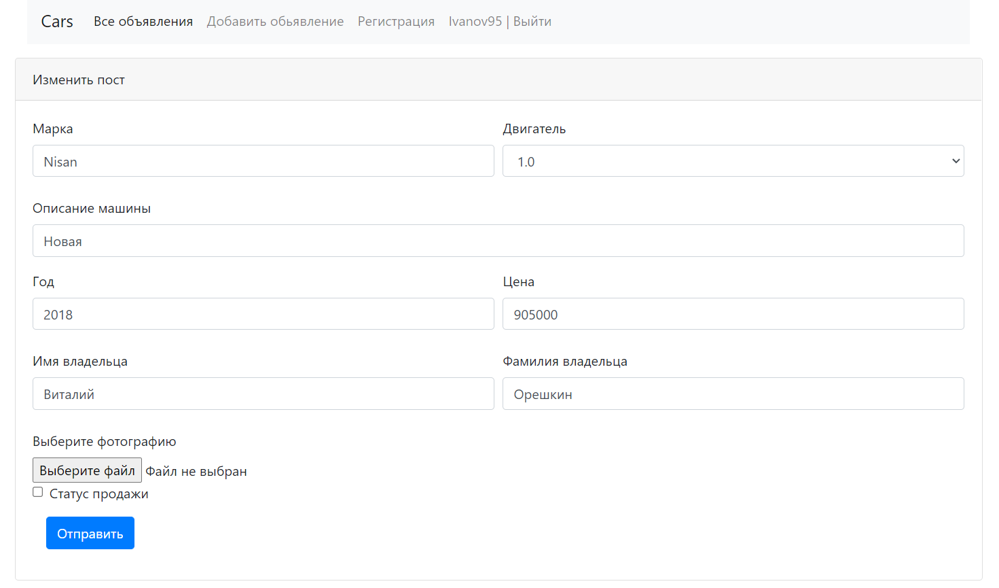
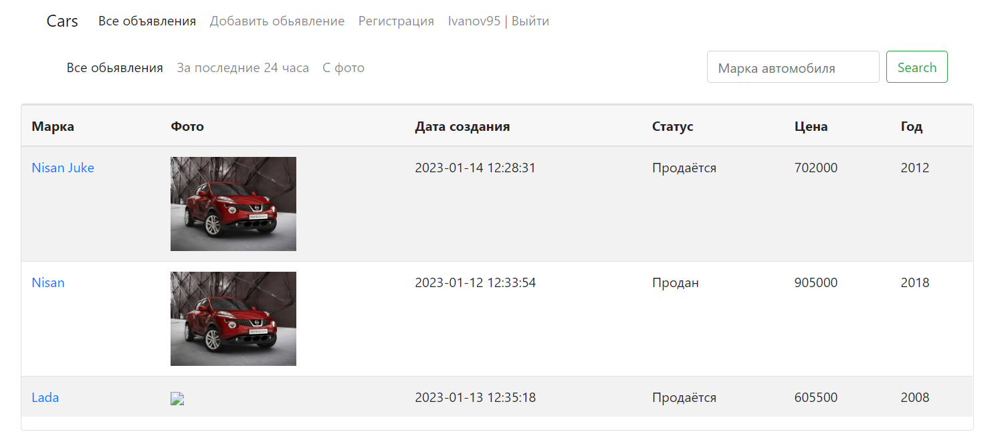
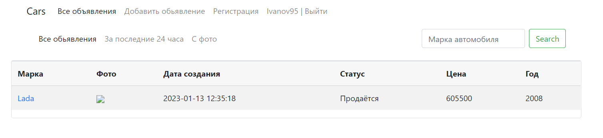
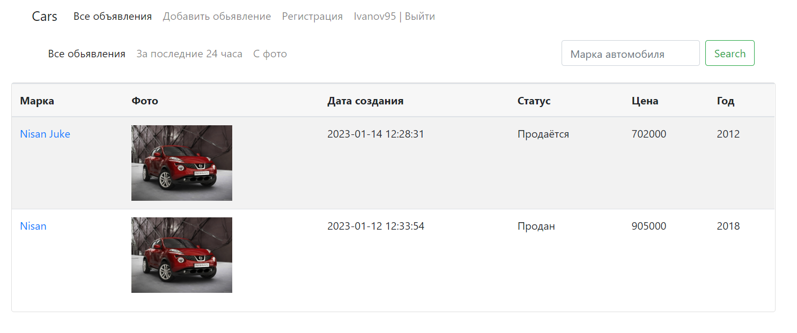

## Автомаг
### Сайт по продаже машин

Сайт по продаже машин.

Есть фильтр в виде регистрации пользователей.

Обьявления можно добавлять, редактировать, переводить с состояния продажи в состояние продан, удалять. 

Обьявлениях указывают марку машины,
год, описание, цену, владельца.

Взаимодествие производится по средствам WEB интерфейса. 

### Стек технологий:


### Требования к окружению :

- 
- 
- 

### Запуск приложения

Запуск с помощью командной строки:

1. Создать базу данных cars.

```CREATE DATABASE cars;```

2. Перейти в папку с проектом.
3. Выполнить команду: mvn liquibase:update
4. Выполнить команду: mvn clean install
5. Выполнить команду: mvn spring-boot:run
6. Перейти по ссылке: http://localhost:8080

### Виды

#### Вид входа


#### Вид регистрации


#### Вид добавления поста


#### Вид поста


#### Вид редактирования обьявления


#### Главный вид


#### Вид поиска по марке


#### Вид поиска с фото


### Расширения приложения

Обновить дизайн входа, главного вида, поменять навигационную панель.

Добавить личный кабинет пользователя, фильтр для редактирования обьявлений - пользователями которые их добавляли,
выбор региона при регистрации пользователя, отображение времени по часовому поясу пользователя.

Добавить кузов, коробку передач, мощность двигателя, пробег. 

Реализовать подписки, историю изменения цен с выводом на экран, обновив фронт.

### Контакты: @WhiteVax